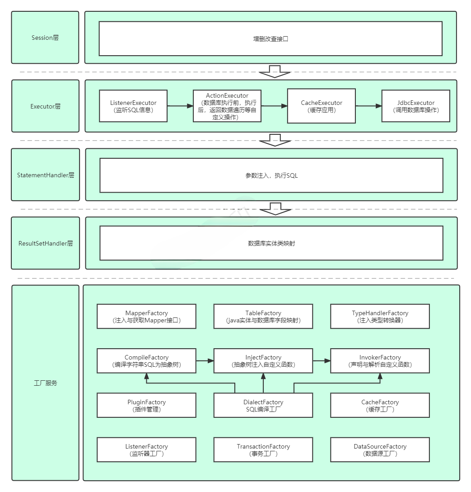
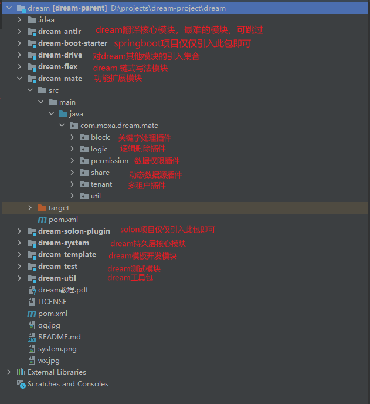

- [1. dream简介](#1-dream简介)
    - [1.1. 特性](#11-特性)
    - [1.2. 支持的数据库](#12-支持的数据库)
    - [1.3. 系统架构](#13-系统架构)
    - [1.4. 代码结构](#14-代码结构)
- [2. 快速开始](#2-快速开始)
    - [2.1. 整合springboot/solon](#21-整合springbootsolon)
    - [2.2. dream配置](#22-dream配置)
- [3. 操作模式](#3-操作模式)
    - [3.1. 模板操作](#31-模板操作)
    - [3.2. 链式操作](#32-链式操作)
    - [3.3. 自定义Mapper操作](#33-自定义mapper操作)
- [4. 基础开发](#4-基础开发)
    - [4.1. 内置@函数](#41-内置函数)
        - [4.1.1. ?](#411-)
        - [4.1.2. rep](#412-rep)
        - [4.1.3. foreach](#413-foreach)
        - [4.1.4. non](#414-non)
        - [4.1.5. not](#415-not)
        - [4.1.6. \*\*\*\*\*](#416-)
        - [4.1.7. table](#417-table)
    - [4.2. 注解](#42-注解)
        - [4.2.1. Table](#421-table)
        - [4.2.2. Id](#422-id)
        - [4.2.3. Column](#423-column)
        - [4.2.4. Join](#424-join)
        - [4.2.5. View](#425-view)
        - [4.2.6. Ignore](#426-ignore)
        - [4.2.7. PageQuery](#427-pagequery)
        - [4.2.8. Extract](#428-extract)
    - [4.3. 监听器](#43-监听器)
    - [4.4. 插件](#44-插件)
    - [4.5. IService](#45-iservice)
- [5. 高级开发](#5-高级开发)
    - [5.1. 关键字插件](#51-关键字插件)
    - [5.2. 多数据源](#52-多数据源)
    - [5.3. 多租户](#53-多租户)
    - [5.4. 数据权限](#54-数据权限)
    - [5.5. 逻辑删除](#55-逻辑删除)
    - [5.6. 数据缓存](#56-数据缓存)
    - [5.7. 主键策略](#57-主键策略)
    - [5.8. 关联查询](#58-关联查询)
    - [5.9. 数据填充](#59-数据填充)
    - [5.10. 数据脱敏](#510-数据脱敏)
    - [5.11. SQL审计](#511-sql审计)
    - [5.12. SQL打印](#512-sql打印)
    - [5.13. 字段权限](#513-字段权限)
    - [5.14. 字段加密](#514-字段加密)
    - [5.15. 字典回写](#515-字典回写)
- [6. 问题](#6-问题)
- [7. 联系方式](#7-联系方式)

# 1. dream简介

dream-orm是一个自主研发类似mybatis的持久层框架。

轻便，它非常轻量，不依赖第三方jar包 灵巧，拥有极高的性能与灵活性，在满足类Mybatis框架功能上，它还首创SQL方言翻译，通过SQL方言转换技术（几乎无性能损耗）只要你会MySQL的SQL写法，那么你可以无缝移植到非MySQL数据库。

极速开发，内置的QueryDef不仅帮助开发者极大减少SQL编写的工作同时，减少出错的可能性，而且基本上支持MySQL所有函数，支持常见的SQL语句改写成java链式形式。

dream-orm不仅能够极大的提高开发效率与开发体验，让开发者有更多的时间专注于自己的事，而且还能根据业务进行函数化封装。

## 1.1. 特性

**跨平台**：支持mysql语法在非mysql环境下执行，并提供接口自定义翻译

**轻量级**：整个框架不依赖任何第三方依赖，而且做到了对每一条SQL深度解析，可改写SQL，性能更优

**灵活**：匠心独运的架构设计，结构层次分明，特别注重如何优雅的设计，设计强调用户开发应该继承接口实现自定义，而不是传入参数

**函数化**：设计围绕的核心，原理基于SQL的深度解析，开发者可自定义开发与业务有关的高级功能，愿景：每个公司都有自己的函数库

**强大**：嵌套映射、注解校验，数据权限，逻辑删除，多租户，多数据源，参数值注入与修改（可完成注入默认值、字段加密等），主键序列（可自定义）、查询字段值提取（可完成解密、查询字典和库表、脱密等）

## 1.2. 支持的数据库

dream-orm支持MySQL、PGSQL、SQLSERVER、ORACLE、达梦，其他数据库语法和提供支持的数据库语法类似，对于特殊的数据库，开发者也可以自己写对应的SQL转换语句，把抽象树转换对应可执行的SQL即可

## 1.3. 系统架构



## 1.4. 代码结构



# 2. 快速开始

## 2.1. 整合springboot/solon

整合springboot项目和solon项目配置是一样的。

**第一步：引入依赖**

springboot项目

项目演示地址（ https://gitee.com/moxiaoai/dream-orm/tree/master/dream-test/dream-orm-simple-test ）

```xml

<dependency>
    <groupId>com.dream-orm</groupId>
    <artifactId>dream-orm-spring-boot-starter</artifactId>
    <version>1.0.0</version>
</dependency>
```

solon项目

项目演示地址（ https://gitee.com/moxiaoai/dream-orm/tree/master/dream-test/dream-orm-solon-test ）

```xml

<dependency>
    <groupId>com.dream-orm</groupId>
    <artifactId>dream-orm-solon-plugin</artifactId>
    <version>1.0.0</version>
</dependency>
```

**第二步：编写Table实体类**

```java

@Table("user")
public class User {
    @Id
    @Column("id")
    private Integer id;
    @Column(value = "name", jdbcType = Types.VARCHAR)
    private String name;
    @Column("age")
    private Integer age;
    @Column("email")
    private String email;
    @Column("tenant_id")
    private Integer tenantId;
    @Column("dept_id")
    private Integer deptId;
    @Column("del_flag")
    private Integer delFlag;
}
```

**第三步：编写View实体类**

不同于Table实体类，Table实体类等价于数据库表所有字段，而View实体类是指数据库表部分字段，因为一些业务场景，仅仅需要业务部分字段就够啦

```java

@View(User.class)
public class UserView2 {
    private Integer id;
    private String name;
}
```

**第四步：编译mapper接口（非必要）**

```java

@Mapper
public interface UserMapper {
    @Sql("select @*() from user")
    List<User> findAll();

    @Sql("select @*() from user")
    List<UserView2> selectAll2();
}
```

**第五步：注入ConfigurationBean对象**

```java
@Bean
public ConfigurationBean configurationBean(){
        ConfigurationBean configurationBean=new ConfigurationBean(table实体类包名,mapper实体类包名);
        return configurationBean;
        }
```

**第六步：数据查询**

**模板查询：**

TemplateMapper在springboot项目里使用@Autowired，solon使用@Inject注解即可自动装配

```java
@Autowired
private TemplateMapper templateMapper;
        List<UserView2>list=templateMapper.selectList(UserView2.class,null);
```

**mapper接口查询：**

```java
@Autowired
private UserMapper userMapper;
        List<User>list=userMapper.findAll();
        List<UserView2>=userMapper.selectAll2();
```

**QueryDef查询**

FlexMapper在springboot项目里使用@Autowired，solon使用@Inject注解即可自动装配

```java
@Autowired
private FlexMapper flexMapper;
        FromDef fromDef=select(user.name).from(user);
        List<User> list=flexMapper.selectList(fromDef,User.class);
```

**链式查询**

```java
@Autowired
private FlexChainMapper flexChainMapper;
        List<User> userList=flexChainMapper.select(user.name).from(user).list(User.class);
```

## 2.2. dream配置

springboot项目可以阅读com.moxa.dream.boot.autoconfigure.DreamAutoConfiguration获取配置详情

solon项目可以阅读com.moxa.dream.solon.plugin.DreamAutoConfiguration获取配置详情

**常用配置**

**指定SQL目标方言**

```java
@Bean
public ToSQL toSQL(){
        ToSQL toSQL=new ToMYSQL();
        return toSQL;
        }
```

**指定主键生成策略**

```java
@Bean
public Sequence sequence(){
        return new MySQLSequence();
        }
```

**配置监听器，列如查看SQL执行日志**

```java
@Bean
public Listener[]listeners(){
        return new Listener[]{new DebugListener()};
        }
```

# 3. 操作模式

## 3.1. 模板操作

**基础操作**

dream-orm提供实例的TemplateMapper完成基础操作

| 方法名                                                          | 描述                      |
|--------------------------------------------------------------|-------------------------|
| selectById(Class<T> type, Object id)                         | 主键查询（支持多表关联查询）          |
| selectByIds(Class<T> type, Collection<?> idList)             | 主键批量查询(支持多表关联查询)        |
| selectOne(Class<T> type, Object conditionObject)             | 根据注解生成条件，查询一条           |
| selectList(Class<T> type, Object conditionObject)            | 根据注解生成条件，查询多条           |
| selectTree(Class<T> type, Object conditionObject)            | 根据注解生成条件，查询，并返回树形结构     |
| selectPage(Class<T> type, Object conditionObject, Page page) | 根据注解生成条件，分页查询多条         |
| updateById(Object view)                                      | 主键更新                    |
| updateNonById(Object view)                                   | 主键非空更新，注意：空字符串也更新       |
| insert(Object view)                                          | 插入                      |
| insertFetchKey(Object view)                                  | 插入并在view属性记录主键值         |
| deleteById(Class<?> type, Object id)                         | 主键删除                    |
| deleteByIds(Class<?> type, Collection<?> idList)             | 主键批量删除                  |
| existById(Class<?> type, Object id)                          | 判断主键是否存在                |
| exist(Class<?> type, Object conditionObject)                 | 根据注解生成条件，判断是否存在         |
| batchInsert(Collection<?> viewList)                          | 批量插入，默认一千作为一个批次，可设置批次   |
| batchUpdateById(Collection<?> viewList)                      | 批量主键更新，默认一千作为一个批次，可设置批次 |

**注解生成条件**

**Validated**

用法：对传入的参数进行校验

```java
public @interface Validated {
    Class<? extends Validator> value();
}
```

| 属性名   | 描述  |
|-------|-----|
| value | 校验器 |

```java
public interface Validator<T> {
    default boolean isValid(Session session, Class type, Field field, Command command) {
        return true;
    }

    void validate(T value, Map<String, Object> paramMap);
}
```

| 属性名                                       | 描述                             |
|-------------------------------------------|--------------------------------|
| isValid                                   | 返回值标识是否进行校验，如校验，才会进行validate方法 |
| validate，参数value：待校验的值，paramMap：开发者自定义的参数 | 数据校验，选择性抛异常                    |

已实现的Validator

| Validator类           | 描述                         |
|----------------------|----------------------------|
| AssertFalseValidator | 校验值若不为空，值必须为false          |
| AssertTrueValidator  | 校验值若不为空，值必须为true           |
| LengthValidator      | 校验值若不为空，校验值长度              |
| MaxValidator         | 校验值若不为空，校验值是否超过最大值         |
| MinValidator         | 校验值若不为空，校验值是否小于最小值         |
| NotBlankValidator    | 校验值不能为空，且不能为空字符串           |
| NotNullValidator     | 校验值不能为空                    |
| PatternValidator     | 校验值若不为空，校验满足正则表达式          |
| RangeValidator       | 校验值若不为空，校验值是否在规定范围         |
| SizeValidator        | 校验值若不为空，校验集合或map的大小是否在规定范围 |
| UniqueValidator      | 校验值若不为空，与数据库校验值是否唯一        |

**Wrap**

用法：参数值注入与修改，可完成填充默认值，字段加密等操作

```java
public @interface Wrap {
    Class<? extends Wrapper> value();

    WrapType type() default WrapType.INSERT_UPDATE;
}
```

| 属性名   | 描述               |
|-------|------------------|
| value | 处理的实现类           |
| type  | 处理时机，更新，插入，更新或插入 |

```java
public interface Wrapper {
    Object wrap(Object value);
}
```

| 参数名   | 描述             |
|-------|----------------|
| value | 参数传入值，返回为处理后的值 |

**Conditional**

用法：指定生成的where条件

```java
public @interface Conditional {
    String table() default "";

    boolean nullFlag() default true;

    boolean or() default false;

    Class<? extends Condition> value();
}
```

| 属性名      | 描述             |
|----------|----------------|
| table    | 条件的表名          |
| nullFlag | 为空是否剔除（空字符串为空） |
| or       | 是否采用or，默认and   |
| value    | 生成条件的实现类       |

```java
public interface Condition {
    String getCondition(String table, String column, String field);
}
```

| 参数名    | 描述     |
|--------|--------|
| table  | 表名称    |
| column | 数据库字段名 |
| field  | 对象属性名称 |

已实现的Condition

| Condition类         | 描述              |
|--------------------|-----------------|
| ContainsCondition  | like '%?%'      |
| EndWithCondition   | like '?%'       |
| EqCondition        | =?              |
| GeqCondition       | > =?            |
| GtCondition        | > ?             |
| InCondition        | in(?,?)         |
| NotInCondition     | not in (?,?)    |
| LeqCondition       | <=?             |
| LtCondition        | <?              |
| NeqCondition       | <>?             |
| NotNullCondition   | is not null     |
| NullCondition      | is null         |
| StartWithCondition | like '%?'       |
| BetweenCondition   | between ? and ? |

举例：对于mybatis语法

```xml
where 1=1
<if test="name!=null and name !=''">
    and user.name like('%',name,'%')
</if>
<if test="age!=null">
and age in
<foreach item="item" index="index" collection="age"
         open="(" separator="," close=")">
    #{item}
</foreach>
</if>
```

可改写成

```java
public class UserCondition {
    @Conditional(table = "user", value = ContainsCondition.class)
    private String name;

    @Conditional(value = InCondition.class)
    private List<Integer> age;
}
```

**Sort**

用法：排序

```java
public @interface Sort {
    String table() default "";

    Order value() default Order.ASC;

    int order() default 0;
}
```

| 属性名   | 描述                      |
|-------|-------------------------|
| table | 表名称                     |
| value | 排序方式                    |
| order | 指定多个排序字段时，显示优先级，越小优先级越高 |

## 3.2. 链式以及强化操作

在 dream中，内置了 `QueryDef` 、`UpdateDef`、`deleteDef`、insertDef 用于对数据进行查询、修改、删除和插入操作，也可以基于链式的强化操作进行操作。

**查询SQL**

```sql
select u2.id, u2.name
from (select id, name from user) u2
         left join blog on u2.id = blog.user_id
```

**链式**

```java
UserTableDef u2=new UserTableDef("u2");
        select(u2.id,u2.name)
        .from(table(select(user.id,user.name).from(user)).as("u2"))
        .leftJoin(blog)
        .on(user2.id.eq(blog.user_id))
```

**修改SQL**

```sql
UPDATE `user`
SET `user`.`age`=`user`.`age` + 1
WHERE `user`.`id` = 1
```

**链式**

```
update(user).set(user.age,user.age.add(1)).where(user.id.eq(1))
```

**删除SQL**

```sql
DELETE
FROM `user`
WHERE `user`.`id` = 1
```

**链式**

```
delete(user).where(user.id.eq(1))
```

**插入SQL**

```
INSERT INTO `user` (`id`,`name`)VALUES(1,'name')
```

**链式**

```
insertInto(user).columns(user.id, user.name).values(1, "name")
```

## 3.3. 自定义Mapper操作

归根到底手写SQL才是最强大的

```java

@Mapper(BlogMapperProvider.class)
public interface BlogMapper {
    @Sql("select @*() from blog where user_id=@?(userId)")
    List<Blog> selectBlogByUserId(@Param("userId") Integer userId);

    List<Blog> selectBlogByUserId2(Integer userId);

    default List<Blog> selectBlogByUser(UserView userView) {
        return selectBlogByUserId(userView.getId());
    }
}
```

Param：指定参数名称

```java

@Retention(RetentionPolicy.RUNTIME)
@Target(ElementType.PARAMETER)
public @interface Param {
    String value();
}
```

| 属性名   | 描述   |
|-------|------|
| value | 参数名称 |

每个接口方法必须绑定对应的SQL，有两种绑定形式：

1：在方法上声明注解Sql

```java
public @interface Sql {
    String value();

    boolean cache() default true;

    int timeOut() default 0;
}
```

| 属性名   | 描述         |
|-------|------------|
| value | 绑定的SQL语句   |
| cache | 是否进行数据缓存读取 |
| time  | 超时设置       |

2：在Mapper声明接口方法绑定的Sql

```java
public class BlogMapperProvider {
    public String selectBlogByUserId2() {
        return "select @*() from blog where user_id=@?(userId)";
    }
}
```

也可以返回ActionProvider对象，进行SQL增强操作

```java
public class BlogMapperProvider {
    public ActionProvider selectBlogByUserId2() {
        return new BlogActionProvider();
    }
}
```

```java
public interface ActionProvider {
    String sql();

    default Action[] initActionList() {
        return null;
    }

    default Action[] destroyActionList() {
        return null;
    }

    default Class<? extends Collection> rowType() {
        return null;
    }

    default Class<?> colType() {
        return null;
    }

    default Boolean cache() {
        return null;
    }

    default Integer timeOut() {
        return null;
    }

    default StatementHandler statementHandler() {
        return null;
    }

    default ResultSetHandler resultSetHandler() {
        return null;
    }
}
```

| ActionProvider方法  | 描述               |
|-------------------|------------------|
| sql               | 待执行的SQL语句        |
| initActionList    | SQL执行前，待执行的行为    |
| destroyActionList | SQL执行后，待执行的行为    |
| rowType           | 接受的集合类型，一般系统判断即可 |
| colType           | 接受的对象类型，一般系统判断即可 |
| cache             | 是否使用缓存           |
| timeOut           | 超时设置             |
| statementHandler  | 最终交互的数据库操作，默认即可  |
| resultSetHandler  | 自定义结果集映射         |

# 4. 基础开发

## 4.1. 内置@函数

### 4.1.1. ?

**用法**

与参数有关的函数，将参数改成?

**举例**

```java

@Mapper
public interface UserMapper {
    @Sql("select id, name, age,email from user where name = @?(name)")
    User findByName(String name);
}
```

**测试**

```java

@RunWith(SpringRunner.class)
@SpringBootTest(classes = BootApplication.class)
public class QueryTest {
    @Autowired
    private UserMapper userMapper;

    @Test
    public void test() {
        User user = userService.findByName("Jone");
    }
}
```

**控制台输出**

```tex
SQL:SELECT id,name,age,email FROM user WHERE name=?
PARAM:[Jone]
```

### 4.1.2. rep

**用法**

与参数有关的函数，将参数带入sql

**举例**

```java

@Mapper
public interface UserMapper {
    @Sql("select id, name, age,email from user where name = @rep(name)")
    User findByName2(String name);
}
```

**测试**

```java

@RunWith(SpringRunner.class)
@SpringBootTest(classes = BootApplication.class)
public class QueryTest {
    @Autowired
    private UserMapper userMapper;

    @Test
    public void test() {
        User user = userMapper.findByName2("'Jone'");
    }
}    
```

**控制台输出**

```tex
SQL:SELECT id,name,age,email FROM user WHERE name='Jone'
PARAM:[]
```

### 4.1.3. foreach

**用法**

遍历集合或数组

**举例：删除数组**

```java

@Mapper
public interface UserMapper {
    @Sql("delete from user where id in (@foreach(list))")
    int delete(List<Integer> idList);
}
```

**测试**

```java

@RunWith(SpringRunner.class)
@SpringBootTest(classes = BootApplication.class)
public class DeleteTest {
    @Autowired
    private UserMapper userMapper;

    @Test
    public void deleteById2() {
        templateMapper.deleteByIds(User.class, Arrays.asList(1, 2, 3, 4, 5, 6));
    }
}    
```

**控制台输出**

```tex
SQL:DELETE FROM user WHERE id IN (?,?,?,?,?,?)
PARAM:[1, 2, 3, 4, 5, 6]
```

**举例：删除用户数组**

```java

@Mapper
public interface UserMapper {
    @Sql("delete from user where id in (@foreach(list,@?(item.id)))")
    int delete(@Param("list") List<User> userList);
}
```

**测试**

```java

@RunWith(SpringRunner.class)
@SpringBootTest(classes = BootApplication.class)
public class DeleteTest {
    @Autowired
    private UserMapper userMapper;

    @Test
    public void deleteBatch() {
        List<User> userList = new ArrayList<>();
        User user = new User();
        user.setId(1);
        User user2 = new User();
        user2.setId(2);
        userList.add(user);
        userList.add(user2);
        userMapper.delete(userList);
    }
}    
```

**控制台输出**

```tex
方法：mapper.com.dream.base.UserMapper.delete
语句：DELETE FROM user  WHERE id IN (?,?)
参数：[1, 2]
```

### 4.1.4. non

**用法**

空条件剔除

**举例**

```java

@Mapper
public interface UserMapper {
    @Sql("update user set @non(name=@?(user.name),age=@?(user.age),email=@?(user.email)) where id=@?(user.id)")
    Integer updateNon(User user);
}
```

**注：空字符串不为空**

**测试**

```java

@RunWith(SpringRunner.class)
@SpringBootTest(classes = BootApplication.class)
public class UpdateTest {
    @Autowired
    private UserMapper userMapper;

    @Test
    public void updateNonId2() {
        User user = new User();
        user.setId(1);
        user.setName("hli");
        user.setEmail("");
        userMapper.updateNon(user);
    }
}  
```

**控制台输出**

```tex
SQL:UPDATE user SET name=?,email=? WHERE id=?
PARAM:[hli, , 1]
```

### 4.1.5. not

**用法**

空条件剔除

注：空字符串为空

### 4.1.6. *****

**用法**

1：根据java属性识别查询字段

2：根据SQL查询前后文排除字段

**举例**

```java

@Mapper
public interface UserMapper {
    @Sql("select @*(),'hello' name from user")
    List<User> findAll();
}
```

**注：后文查询 'hello'**

**测试**

```java

@RunWith(SpringRunner.class)
@SpringBootTest(classes = BootApplication.class)
public class QueryTest {
    @Autowired
    private UserMapper userMapper;

    @Test
    public void test3() {
        List<User> userList = userMapper.findAll();
        userList.forEach(System.out::println);
    }
} 
```

**控制台输出**

```tex
SQL:SELECT user.id,user.age,user.email,'hello' name FROM user
PARAM:[]
TIME:25ms

User{id=1, name='hello', age=18, email='test1@baomidou.com'}
User{id=2, name='hello', age=20, email='test2@baomidou.com'}
User{id=3, name='hello', age=28, email='test3@baomidou.com'}
User{id=4, name='hello', age=21, email='test4@baomidou.com'}
User{id=5, name='hello', age=24, email='test5@baomidou.com'}
```

### 4.1.7. table

**用法**

自动将表拼接成关联条件

**举例**

```java
public interface UserMapper {
    @Sql("select @*() from @table(user,blog)")
    List<User> selectAll3();
}
```

**测试**

```java
 @Test
public void test8(){
        List<User> userList=userMapper.selectAll3();
        }
```

**控制台输出**

```tex
执行SQL:SELECT user.id,user.name,user.age,user.email,blog.id,blog.name,blog.user_id FROM  user  LEFT JOIN blog ON user.id=blog.user_id
执行参数:[]
执行用时：17ms
```

## 4.2. 注解

### 4.2.1. Table

**用法**

绑定类对象与数据表

```java

@Retention(RetentionPolicy.RUNTIME)
@Target(ElementType.TYPE)
public @interface Table {
    String value();
}
```

| 注解属性  | 描述       |
|-------|----------|
| value | 指定绑定的数据表 |

**举例**

```java

@Table("user")
public class User {
}
```

### 4.2.2. Id

**用法**

声明表主键

**注：应用于仅当表有且仅有一个主键**

```java

@Retention(RetentionPolicy.RUNTIME)
@Target(ElementType.FIELD)
public @interface Id {

}
```

**举例**

```java

@Table("user")
public class User {
    @Id
    @Column("id")
    private Integer id;
}
```

### 4.2.3. Column

**用法**

绑定类对象属性与数据表字段

```java

@Retention(RetentionPolicy.RUNTIME)
@Target(ElementType.FIELD)
public @interface Column {
    String value();

    int jdbcType() default Types.NULL;
}
```

| 注解属性     | 描述       |
|----------|----------|
| value    | 绑定的数据表字段 |
| jdbcType | 数据表字段类型  |

**举例**

```java

@Table("user")
public class User {
    @Id
    @Column("id")
    private Integer id;
    @Column(value = "name", jdbcType = Types.VARCHAR)
    private String name;
    @Column("age")
    private Integer age;
    @Column("email")
    private String email;
}
```

### 4.2.4. Join

**用法**

指明表于表关联关系，目的为消灭sql语句写表与表关联而生，@函数table基于此

```java

@Retention(RetentionPolicy.RUNTIME)
@Target(ElementType.FIELD)
public @interface Join {
    String column();

    String joinColumn();

    JoinType joinType() default JoinType.LEFT_JOIN;
}
```

| 注解属性       | 描述      |
|------------|---------|
| column     | 该表字段名   |
| joinColumn | 关联表的字段名 |
| joinType   | 关联类型    |

**注：数据表名根据修饰的类属性判断**

**举例**

```java

@Table("user")
public class User {
    @Id
    @Column("id")
    private Integer id;
    @Column(value = "name", jdbcType = Types.VARCHAR)
    private String name;
    @Column("age")
    private Integer age;
    @Column("email")
    private String email;
    @Join(column = "id", joinColumn = "user_id", joinType = Join.JoinType.LEFT_JOIN)
    private List<Blog> blogList;
}
```

**注：类Blog必须有注解Table**

### 4.2.5. View

**用法**

视图概念，截取数据表的部分数据操作

```java

@Retention(RetentionPolicy.RUNTIME)
@Target(ElementType.TYPE)
public @interface View {
    Class<?> value();
}
```

| 注解属性  | 描述       |
|-------|----------|
| value | 来源数据表映射类 |

**注：View修饰的类属性，必须和Table修饰的属性一致，才能做到映射**

**举例**

仅仅就想查询id以及name字段，email与age不查询

```java

@View(User.class)
public class UserView2 {
    private Integer id;
    private String name;
}
```

```java
  @Sql("select @*() from user")
    List<UserView2> selectAll2();
```

**测试**

```java
  @Test
public void test7(){
        List<UserView2> userViews=userMapper.selectAll2();
        }
```

**控制台输出**

```java
SQL:SELECT user.id,user.name FROM user
        PARAM:[]
        TIME:33ms
```

**注：做到修改字段就可以间接修改SQL语句目的，存在情况，view字段与table字段一致，但不想查询，或者不想多表查询，可以使用Ignore忽略此字段
**

### 4.2.6. Ignore

**用法**

查询结果自动映射到对象，忽视此字段

```java

@Retention(RetentionPolicy.RUNTIME)
@Target(ElementType.FIELD)
public @interface Ignore {

}
```

**举例**

```java

@View("user")
public class UserView {
    private Integer id;
    private String name;
    @Ignore
    private String email;
}
```

**注：email存在Ignore，email数据为空**

### 4.2.7. PageQuery

**用法**

分页

```java

@Retention(RetentionPolicy.RUNTIME)
@Target(ElementType.METHOD)
public @interface PageQuery {
    boolean offset() default false;

    String value() default "page";
}
```

| 属性名    | 描述                   |
|--------|----------------------|
| offset | 是否使用offset分页，默认limit |
| value  | Page对象地址             |

**举例**

```java

@Mapper
public interface UserMapper {
    @Sql("select id, name, age,email from user order by id")
    @PageQuery("page")
    List<User> findByPage(@Param("page") Page page);
}
```

**测试**

```java
@Test
public void testPage(){
        Page page=new Page(1,1);
        List<User> userList=userMapper.findByPage(page);
        page.setRows(userList);
        System.out.println("总数："+page.getTotal());
        }
```

**控制台输出**

```tex
SQL:SELECT id,name,age,email FROM user ORDER BY id LIMIT ?,?
PARAM:[0, 1]
SQL:SELECT COUNT(1) FROM user
PARAM:[]
TIME:24ms
TIME:36ms
总数：5
```

### 4.2.8. Extract

用法：对查询的值做处理，列如，解密，字段脱敏，反查字典等操作

```java
public @interface Extract {
    Class<? extends Extractor> value();
}
```

| 属性名   | 描述       |
|-------|----------|
| value | 提取的具体操作类 |

```java
public interface Extractor {
    default void init(Field field) {

    }

    void extract(String property, Object value, ObjectFactory objectFactory);
}
```

| 参数名           | 描述            |
|---------------|---------------|
| property      | 属性名           |
| value         | 数据库查询的值       |
| objectFactory | 反射工厂，用来给字段填充值 |

## 4.3. 监听器

**用法**

检查、阻断SQL、SQL审计、修改查询数据

```java
public interface Listener {
    boolean before(MappedStatement mappedStatement);

    Object afterReturn(Object result, MappedStatement mappedStatement);

    void(Exception e, MappedStatement mappedStatement);
}
```

| 方法名         | 描述                 |
|-------------|--------------------|
| before      | 返回false，SQL不执行，返回空 |
| afterReturn | 返回结果为查询结果          |
| exception   | 出现异常调用此处           |

## 4.4. 插件

**用法**

基于接口代理实现，可以修改参数

```java
public interface Interceptor {
    Object interceptor(Invocation invocation) throws Throwable;

    Set<Method> methods();
}
```

| 方法名         | 描述       |
|-------------|----------|
| interceptor | 此处进行注入插件 |
| methods     | 拦截感兴趣的方法 |

## 4.5. IService

dream提供了一个名为 `IService` 的接口，及其默认实现类 `ServiceImpl` ，用于简化在 「Service」 层重复定义 「Mapper」 层的方法。

# 5. 高级开发

### 5.1. 关键字插件

数据库关键字，不是关键字可以不加特殊符号，关键字必须要加，dream提供方案，SQL语句可以不加特殊符号对关键字处理，一样可以正常执行

SQL语句，若user和id为关键字，不做处理会执行报错，正确做法需要对user和id加特殊符号

```sql
SELECT *
FROM (
         SELECT u.id,
                u.NAME,
                u.age,
                u.email,
                b.id   bId,
                b.NAME bName
         FROM USER u
                  LEFT JOIN blog b ON b.user_id = u.id
     ) t_tmp LIMIT 1
```

开启关键字插件

```sql
SELECT *
FROM (
         SELECT u.`id`,
                u.NAME,
                u.age,
                u.email,
                b.`id` bId,
                b.NAME bName
         FROM `USER` u
                  LEFT JOIN blog b ON b.user_id = u.`id`
     ) t_tmp LIMIT 1
```

自动完成对user和id关键字处理，性能等价于直接写关键字处理

**开启插件**

```java
   @Bean
public Inject[]injects(){
        return new Inject[]{new BlockInject("META-INF/keyword.txt")};
        }
```

META-INF/keyword.txt记录了自定义关键字

### 5.2. 多数据源

**开启注解**

```java
public @interface EnableShare {
    Class<? extends DataSource> value();
}
```

| 属性    | 描述              |
|-------|-----------------|
| value | DataSource实现类类型 |

**数据源配置**

```yaml
dream:
  datasource:
    master:
      driverClassName: com.mysql.jdbc.Driver
      jdbcUrl: jdbc:mysql://192.168.0.3/d-open
      username: root
      password: root
      keepaliveTime: 1000
      isReadOnly: false
    slave:
      driverClassName: com.mysql.jdbc.Driver
      jdbcUrl: jdbc:mysql://192.168.0.3/d-open-6c
      username: root
      password: root
```

注：dream.datasource固定，master和slave为数据连接池名称，其他为数据连接池字段属性

**数据源选择**

```java
public @interface Share {
    String value();
}
```

| 属性    | 描述                |
|-------|-------------------|
| value | 数据连接池名称，默认是master |

**举例**

```java

@Share("master")
public interface UserMapper {
    @Sql("select id, name, age,email from user where name = @?(name)")
    List<User> findByName(String name);

    @Share("slave")
    @Sql("select id, name, age,email from user where name = @rep(name)")
    List<User> findByName2(String name);
}
```

### 5.3. 多租户

考虑同一个库，同一个schema情况，将现有项目改写成多租户，实现成本是多少，可能会说成本太大啦，所有SQL基本上都要翻新，而dream却给了你0成本方案，既然无感知，成本自然为0

查询用户表user和文章表blog的前一条数据

```sql
SELECT *
FROM (
         SELECT u.id,
                u.NAME,
                u.age,
                u.email,
                b.id   bId,
                b.NAME bName
         FROM USER u
                  LEFT JOIN blog b ON b.user_id = u.id
     ) t_tmp LIMIT 1
```

若用户表和文章表都存在租户字段，将其改造为多租户，dream可以让你不用修改当前SQL，在启动类添加开启多租户插件即可自动将其改造成多租户

```sql
SELECT *
FROM (
         SELECT u.id,
                u.NAME,
                u.age,
                u.email,
                b.id   bId,
                b.NAME bName
         FROM USER u
                  LEFT JOIN blog b ON (b.user_id = u.id)
             AND b.tenant_id = ?
         WHERE u.tenant_id = ?) t_tmp LIMIT 1
```

dream的识别是高强度的，不会因为SQL复杂，漏加任何租户条件，那性能如何？是等价于直接写租户条件的，无性能损耗

**开启多租户**

```java
    @Bean
public Inject[]injects(){
        return new Inject[]{new TenantInject(()->1)};
        }
```

注：重写TenantHandler完成租户需求

```java
public interface TenantHandler {
    default boolean isTenant(MethodInfo methodInfo, TableInfo tableInfo) {
        return tableInfo.getFieldName(getTenantColumn()) != null;
    }

    default String getTenantColumn() {
        return "tenant_id";
    }

    Object getTenantObject();
}
```

| 方法名             | 描述                                                       |
|-----------------|----------------------------------------------------------|
| isTenant        | 判断当前方法或当前表是否应用租户MethodInfo：记录了方法的一切信息TableInfo：记录了表的一切信息 |
| getTenantColumn | 租户字段                                                     |
| getTenantObject | 租户值                                                      |

**注：一旦当前方法应用租户，租户将完全由系统接管，插入对租户字段赋值，更新赋值将失效**

### 5.4. 数据权限

采用mybatis方案进行数据权限隔离，会在where条件注入 ${权限条件}，是否可以不写${权限条件}，一样完成数据权限注入，这样实现才是真正意义上的权限SQL与业务SQL解耦

同样SQL，需要注入数据权限，假如：查询自己所在部门

```sql
SELECT *
FROM (
         SELECT u.id,
                u.NAME,
                u.age,
                u.email,
                b.id   bId,
                b.NAME bName
         FROM USER u
                  LEFT JOIN blog b ON b.user_id = u.id
     ) t_tmp LIMIT 1
```

开启数据权限插件

```sql
SELECT *
FROM (
         SELECT u.id,
                u.NAME,
                u.age,
                u.email,
                b.id   bId,
                b.NAME bName
         FROM USER u
                  LEFT JOIN blog b ON b.user_id = u.id
         WHERE u.dept_id = 1
     ) t_tmp LIMIT 1
```

u.dept_id=1是开发者自己注入的数据权限，不要担心，dream会解析出别名告诉开发者，完成数据权限注入，此时，SQL非常清爽，性能等价于在SQL直接写注入权限条件

**开启数据权限**

```java
    @Bean
public Inject[]injects(){
        return new Inject[]{new PermissionInject(new PermissionHandler(){
@Override
public boolean isPermissionInject(MethodInfo methodInfo,TableInfo tableInfo){
        return tableInfo.getFieldName("dept_id")!=null;
        }

@Override
public String getPermission(MethodInfo methodInfo,TableInfo tableInfo,String alias){
        return alias+".dept_id=1";
        }
        })};
        }
```

```java
public interface PermissionHandler {
    boolean isPermissionInject(MethodInfo methodInfo, TableInfo tableInfo);

    String getPermission(MethodInfo methodInfo, TableInfo tableInfo, String alias);

}
```

| 方法名                | 描述                                                                         |
|--------------------|----------------------------------------------------------------------------|
| isPermissionInject | 是否对当前查询语句注入where条件，methodInfo：记录了方法的一切信息tableInfo：记录了表的一切信息                |
| getPermission      | 插入的where条件，不能为空，methodInfo：记录了方法的一切信息tableInfo：记录了表的一切信息，alias：当前查询语句主表的别名 |

### 5.5. 逻辑删除

有些字段是需要进行逻辑删除的，有些字段不需要，区别在于表是否加了逻辑字段，假如：未来有个需求，这个表不需要逻辑删除，另一张表需要逻辑删除，代码修改必不可少，幸运的是有些框架提供了逻辑删除，自动将delete语句改成update语句，代码量基本上无改动，事实上，表与表之间关联条件以及where条件是否都加了逻辑条件，仍然需要一步一步改。

同样的SQL，假设用户表user和文章表都存在逻辑删除字段，改造为逻辑删除

```sql
SELECT *
FROM (
         SELECT u.id,
                u.NAME,
                u.age,
                u.email,
                b.id   bId,
                b.NAME bName
         FROM USER u
                  LEFT JOIN blog b ON b.user_id = u.id
     ) t_tmp LIMIT 1
```

开启逻辑删除插件

```sql
SELECT *
FROM (
         SELECT u.id,
                u.NAME,
                u.age,
                u.email,
                b.id   bId,
                b.NAME bName
         FROM USER u
                  LEFT JOIN blog b ON (b.user_id = u.id)
             AND b.del_flag = 0
         WHERE u.del_flag = 0
     ) t_tmp LIMIT 1
```

完成了SQL操作的逻辑字段追加，删除数据库里的逻辑字段就不采用逻辑删除，同样，希望某张表采用逻辑删除，加个逻辑字段即可，代码不需要做任何修改，性能等价于直接写逻辑删除条件，性能无损耗

**开启逻辑删除**

```java
    @Bean
public Inject[]injects(){
        return new Inject[]{new LogicInject(()->"del_flag")};
        }
```

```java
public interface LogicHandler {
    default boolean isLogic(MethodInfo methodInfo, TableInfo tableInfo) {
        return tableInfo.getFieldName(getLogicColumn()) != null;
    }

    default String getNormalValue() {
        return "0";
    }

    default String getDeletedValue() {
        return "1";
    }

    String getLogicColumn();

}
```

| 方法名             | 描述                                               |
|-----------------|--------------------------------------------------|
| isLogic         | 是否使用逻辑删除methodInfo：记录了方法的一切信息tableInfo：记录了表的一切信息 |
| getNormalValue  | 未删除的值                                            |
| getDeletedValue | 逻辑删除后的值                                          |
| getLogicColumn  | 逻辑删除字段                                           |

### 5.6. 数据缓存

dream默认开启基于表的缓存，可重新声明自己的缓存工厂，代替默认工厂即可，不同于其他框架缓存，设计的缓存是基于表的，如果是单系统，且数据修改完全来自框架，可默认开启缓存，对查询的任意SQL都会进行缓存，而且可以保证数据库和缓存一致。

```java
@Bean
public CacheFactory cacheFactory(){
        return new DefaultCacheFactory(){
@Override
public Cache getCache(){
        return null;
        }
        };
        }
```

既然有了缓存工厂，也可以自定义缓存策略

```java
public interface Cache {
    void put(MappedStatement mappedStatement, Object value);

    Object get(MappedStatement mappedStatement);

    void remove(MappedStatement mappedStatement);

    void clear();
}
```

| 方法     | 描述                                                            |
|--------|---------------------------------------------------------------|
| put    | mappedStatement：记录了SQL的详尽信息，包括操作的表名，原始SQL的唯一值，执行SQL的唯一值等，存放数据 |
| get    | 获取数据                                                          |
| remove | 删除数据                                                          |
| clear  | 清空数据                                                          |

### 5.7. 主键策略

主键策略统一控制全局，自定义主键策略

```java
    @Bean
public Sequence sequence(){
        return new SnowFlakeSequence();
        }
```

```java
public class SnowFlakeSequence extends AbstractSequence {
    @Override
    protected Object sequence(TableInfo tableInfo) {
        Class<?> type = tableInfo.getPrimColumnInfo().getField().getType();
        Long nextId = SnowFlake.nextId();
        if (type == Long.class) {
            return nextId;
        } else if (type == String.class) {
            return Long.toHexString(nextId);
        } else if (type == Integer.class) {
            return nextId.intValue();
        }
        throw new SoothException("不支持的主键类型：" + type.getName());
    }
}
```

开发者随意定义主键策略即可

### 5.8. 关联查询

分为一对一，和一对多，多对一，多对多，采用Extract自行开发封装实现

### 5.9. 数据填充

存入数据库，采用wrap实现，读取数据库采用Extract实现

### 5.10. 数据脱敏

存入数据库，采用wrap实现，读取数据库采用Extract实现

### 5.11. SQL审计

采用监听器自由实现

### 5.12. SQL打印

采用监听器自由实现

### 5.13. 字段权限

存入数据库，采用wrap实现，读取数据库采用Extract实现

### 5.14. 字段加密

存入数据库，采用wrap实现，读取数据库采用Extract实现

### 5.15. 字典回写

存入数据库，采用wrap实现，读取数据库采用Extract实现

# 6. 问题

1. 当SQL长度过长，达到几千行以上，翻译报java.lang.StackOverflowError，调大Xss参数

# 7. 联系方式

微信群：QQ群：

